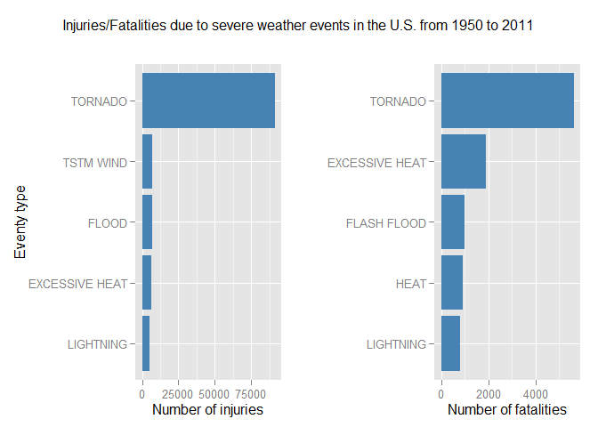
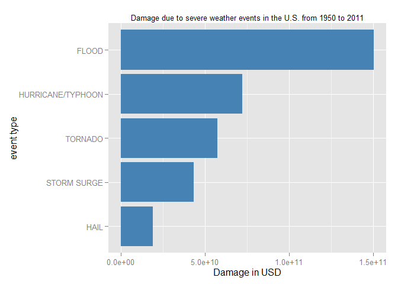

# Analysis of severe weather events impact on communities
Some basic R environment setup:

```r
#set options for values printing
options(scipen=1, digits=2)

# install packages if necessary
if(!is.element("ggplot2", installed.packages()[,1])){
    install.packages("ggplot2")
}
if(!is.element("grid", installed.packages()[,1])){
    install.packages("grid")
}
```
## Synopsis
Storms and other severe weather events can cause both public health and economic problems for communities and municipalities. Many severe events can result in fatalities, injuries, and property damage, and preventing such outcomes to the extent possible is a key concern. Therefore, this report involves some basic exploring of the U.S. National Oceanic and Atmospheric Administration's (NOAA) storm database. The available data was downloaded, preprocessed and then analysis was performed in order to reveal which events has the highest impact on human health and economy. From the presented results, it can be concluded that the most fatalities/injuries in the period 1950-2011 were caused by tornadoes. The highest damage to crops and property was caused by floods.
<br><br>

## Data preprocessing
U.S. National Oceanic and Atmospheric Administration's (NOAA) storm database is available online. Database comes in form of a comma-separated-value file compressed via the bzip2 algorithm to reduce its size. The following code downloads the data from <a href=https://d396qusza40orc.cloudfront.net/repdata%2Fdata%2FStormData.csv.bz2>this website</a> and then reads the data into appropriate data frame called <code>dataStorm</code>.


```r
website <- "http://d396qusza40orc.cloudfront.net/repdata%2Fdata%2FStormData.csv.bz2"

if(!file.exists("RP_data")){
  dir.create("RP_data")
}

download.file(website, destfile = "./RP_data/StormData.csv.bz2")
dateDownloaded <- date()

dataStorm <- read.csv("./RP_data/StormData.csv.bz2", header=TRUE, na.strings = "")
noEvents <- unique(dataStorm$EVTYPE)
```

The analysis presented in this report is based upon the data which was downloaded on Mon May 18 17:33:24 2015. The command <code>summary(dataStorm)</code> reveals some properties of this dataset. There is variable <code>EVTYPE</code> which defines the type of the event. The variables that show the effect of the event on population health are <code>FATALITIES</code> and <code>INJURIES</code>. The variables which show the effect of the event on economy are <code>PROPDMG</code> (stands for property damage) and <code>CROPDMG</code> (stands for crop damage). Therefore, only these variables are further examined.
<br><br>

## Results

In this section, the effect of severe weather events on population health and economy are analyzed.


### The events that are most harmful with respect to human population
The available dataset has 985 unique events. However, only some have resulted in injuries and fatalities. The following code removes rows which has 0 injuries and fatalities. After that, the effects of each event is summed and the resulting data frames (<code>stormInjuries</code> and <code>stormFatalities</code>) are sorted in order to reveal the events with the highest impact on human health.


```r
dataStormPop <- subset(dataStorm[,c("EVTYPE", "FATALITIES", "INJURIES")],
                        FATALITIES > 0 | INJURIES > 0)
stormInjuries <- aggregate(dataStormPop$INJURIES ~ dataStormPop$EVTYPE, dataStormPop, sum)
stormFatalities <- aggregate(dataStormPop$FATALITIES ~ dataStormPop$EVTYPE, dataStormPop, sum)
colnames(stormInjuries) <- c("EVTYPE","INJURIES")
colnames(stormFatalities) <- c("EVTYPE","FATALITIES")

stormInjuries <- stormInjuries[order(-stormInjuries$INJURIES),]
stormFatalities <- stormFatalities[order(-stormFatalities$FATALITIES),]

head(stormInjuries)
```

```
##             EVTYPE INJURIES
## 184        TORNADO    91346
## 191      TSTM WIND     6957
## 47           FLOOD     6789
## 32  EXCESSIVE HEAT     6525
## 123      LIGHTNING     5230
## 69            HEAT     2100
```

```r
head(stormFatalities)
```

```
##             EVTYPE FATALITIES
## 184        TORNADO       5633
## 32  EXCESSIVE HEAT       1903
## 42     FLASH FLOOD        978
## 69            HEAT        937
## 123      LIGHTNING        816
## 191      TSTM WIND        504
```


The impact on population can be presented as a bar graph.


```r
library(ggplot2)
library(grid)

stormInjuries <- stormInjuries[1:5,]
stormFatalities <- stormFatalities[1:5,]
title1 <- sprintf("Injuries/Fatalities due to severe weather events in the U.S. from %s to %s",
                  format(as.Date(dataStorm[1,2],"%m/%d/%Y"), "%Y"),
                  format(as.Date(dataStorm[length(dataStorm[,1]),2],"%m/%d/%Y"), "%Y"))

p1 <- ggplot(data = stormInjuries, aes(x=reorder(EVTYPE, INJURIES), y = INJURIES)) + 
    geom_bar(stat = "identity", fill = "steelblue") + 
    coord_flip() + 
    labs(y = "Number of injuries") + 
    labs(x = "Eventy type")  

p2 <- ggplot(data = stormFatalities, aes(x=reorder(EVTYPE, FATALITIES), y = FATALITIES)) + 
    geom_bar(stat = "identity", fill = "steelblue") + 
    coord_flip() + 
    labs(y = "Number of fatalities") +
    labs(x = " ")  

# Define grid layout to locate plots and print each graph
pushViewport(viewport(layout = grid.layout(2, 2, heights = unit(c(0.5, 4), "null"))))
grid.text(title1, vp = viewport(layout.pos.row = 1, layout.pos.col = 1:2))
print(p1, vp = viewport(layout.pos.row = 2, layout.pos.col = 1))
print(p2, vp = viewport(layout.pos.row = 2, layout.pos.col = 2))
```

 


From the presented bar graphs, it can be concluded that by far most highest impact on human health has **TORNADO** type of event. The **EXCESSIVE HEAT** is the 2nd cause of fatality and the 4th cause of injuries in U.S due to severe weather events.
<br>


### The events that are most harmful with respect to economy
The following code removes rows with strange factors found in <code>PROPDMGEXP</code> and in <code>CROPDMGEXP</code>. Apart from that, only rows which has economic damage greather than zero are taken into account. According to the <code>CROPDMGEXP</code> and <code>PROPDMGEXP</code>, values of <code>PROPDMG</code> and <code>CROPDMG</code> are transformed to USD and the effects of same events are summed and then sorted to reveal the events with the highest impact on economy.


```r
#delete rows where PROPDMGEXP is any of the following values: "-", "?", "+"
#delete rows where CROPDMGEXP is any of the following values: "?"

dataStormEconomy <- dataStorm[!(dataStorm$PROPDMGEXP %in% c("-", "?", "+")),]
dataStormEconomy <- dataStormEconomy[!(dataStormEconomy$CROPDMGEXP %in% c("?")),]

dataStormEconomy <- subset(dataStormEconomy[,c("EVTYPE", "PROPDMG", "PROPDMGEXP", "CROPDMG", "CROPDMGEXP")],
                        PROPDMG > 0 | CROPDMG > 0)

dataStormEconomy[is.na(dataStormEconomy$PROPDMGEXP),3] = 0;
dataStormEconomy[is.na(dataStormEconomy$CROPDMGEXP),5] = 0;


#take into account (most often) PROPDMGEXP and CROPDMGEXP
for (i in 1:length(dataStormEconomy[,1])){
    
    if(dataStormEconomy[i,3] == "K") {dataStormEconomy[i,2] <- 1e3*dataStormEconomy[i,2]}
    else if(dataStormEconomy[i,3] == "M") {dataStormEconomy[i,2] <- 1e6*dataStormEconomy[i,2]}
    else if(dataStormEconomy[i,3] == "B") {dataStormEconomy[i,2] <- 1e9*dataStormEconomy[i,2]}
    else if(dataStormEconomy[i,3] == "5") {dataStormEconomy[i,2] <- 1e5*dataStormEconomy[i,2]}
    else if(dataStormEconomy[i,3] == "m") {dataStormEconomy[i,2] <- 1e6*dataStormEconomy[i,2]}
    else if(dataStormEconomy[i,3] == "0") {dataStormEconomy[i,2] <- 1*dataStormEconomy[i,2]}
    else {dataStormEconomy[i,2] = 0}
    
    if(dataStormEconomy[i,5] == "K") {dataStormEconomy[i,4] <- 1e3*dataStormEconomy[i,4]}
    else if(dataStormEconomy[i,5] == "M") {dataStormEconomy[i,4] <- 1e6*dataStormEconomy[i,4]}
    else if(dataStormEconomy[i,5] == "k") {dataStormEconomy[i,4] <- 1e3*dataStormEconomy[i,4]}
    else if(dataStormEconomy[i,5] == "B") {dataStormEconomy[i,4] <- 1e9*dataStormEconomy[i,4]}
    else if(dataStormEconomy[i,5] == "m") {dataStormEconomy[i,4] <- 1e6*dataStormEconomy[i,4]}
    else if(dataStormEconomy[i,5] == "0") {dataStormEconomy[i,4] <- 1*dataStormEconomy[i,4]}
    else {dataStormEconomy[i,4] = 0}
}


dataStormEconomyImpact <- aggregate((PROPDMG + CROPDMG) ~ EVTYPE, dataStormEconomy, sum)
colnames(dataStormEconomyImpact) <- c("EVTYPE","DMG")

dataStormEconomyImpact <- dataStormEconomyImpact[order(-dataStormEconomyImpact$DMG),]

head(dataStormEconomyImpact)
```

```
##                EVTYPE     DMG
## 70              FLOOD 1.5e+11
## 194 HURRICANE/TYPHOON 7.2e+10
## 351           TORNADO 5.7e+10
## 296       STORM SURGE 4.3e+10
## 113              HAIL 1.9e+10
## 58        FLASH FLOOD 1.8e+10
```

Here is a bar plot which indicates an impact of severe weather events on economy in terms of property damage and crop damage in USD. Only the events with highest damage to the properties and crops are plotted.


```r
dataStormEconomyImpact <- dataStormEconomyImpact[1:5,]

title2 <- sprintf("Damage due to severe weather events in the U.S. from %s to %s",
                  format(as.Date(dataStorm[1,2],"%m/%d/%Y"), "%Y"),
                  format(as.Date(dataStorm[length(dataStorm[,1]),2],"%m/%d/%Y"), "%Y"))

ggplot(data = dataStormEconomyImpact, aes(x=reorder(EVTYPE, DMG), y = DMG)) +
    geom_bar(stat = "identity", fill = "steelblue") +
    coord_flip() +
    labs(x = "event type") +
    labs(y = "Damage in USD") +
    labs(title = title2) + 
    theme(plot.title = element_text(size = 10))
```

 

It can be concluded that **floods** are most disastrous, causing damage that counts in 150 bilions of USD, followed by **hurricanes/typhoones** and **tornadoes**.
<br><br>
